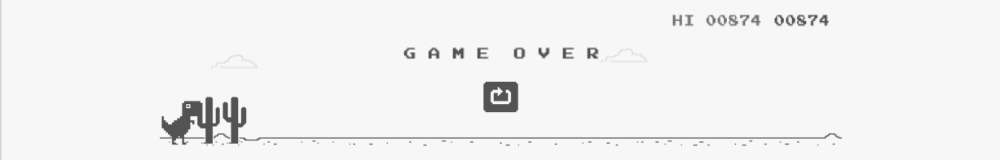

  
  <a href="https://abd-01.github.io/mQnWbEvRcTxYzU/" target="_blank"><small><small>Play Again</small></small></a>

## I am Muhammed Abdullah
<!--
#### I write programs, that transcends beyond the screen, bringing the metal to life.
-->
#### My code, like my life, has to mean something. It must serve. It must endure. But it must never be blind.

<!--  
Where code meets circuits, and software dances with hardware – because the thrill of programming is best felt when it moves beyond the screen. 

Writing code that resonates with hardware, because true magic happens when software and circuits harmonize.

Coding with a passion for hardware – because great software extends beyond the screen.
-->

- 🔭 I’m currently working as an Embedded Software Engineer at [Accolade Electronics](https://accoladeelectronics.com/).
- 🎓 I’ve a degree in Electrical and Electronics from [Visvesvaraya National Institute of Technology](https://en.wikipedia.org/wiki/Visvesvaraya_National_Institute_of_Technology_Nagpur).
- 🤝 I’ve spent most of my time in college at [IvLabs](https://www.ivlabs.in/), the AI and Robotics Lab.
- 🤖 I’m looking to collaborate on LLM based robot manipulation.
<!-- - 🤔 I’m looking for help with MS application for Fall-25. -->
- ⚡ Fun fact: You can try but cannot play Chrome Dino game in github readme.
-   How to reach me: 
  - <a target="_blank" href="mailto:muhammed.abd.shaikh@gmail.com">muhammed.abd.shaikh@gmail.com</a>
  - <a target="_blank" href="https://www.linkedin.com/in/muhammedabd/">linkedin.com/in/muhammedabd/</a>

<!-- 2. - 🌱 I’m currently learning RTOS, CAN  -->
<!-- - 💬 Ask me about  -->

# Projects
### 🚀 Noteworthy Mention

&emsp;

### 🔬Research Work

&emsp;

###  Deep Learning

&emsp;

###  Miscellaneous

&emsp;

 

&emsp;

###  Android

&emsp;

  

